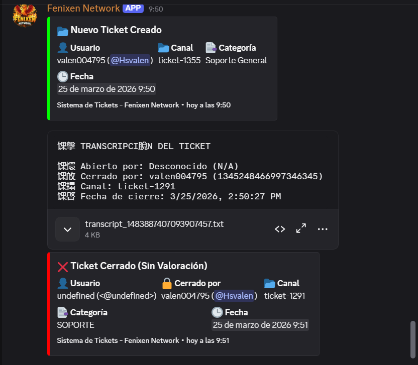
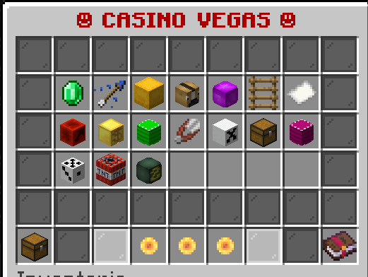
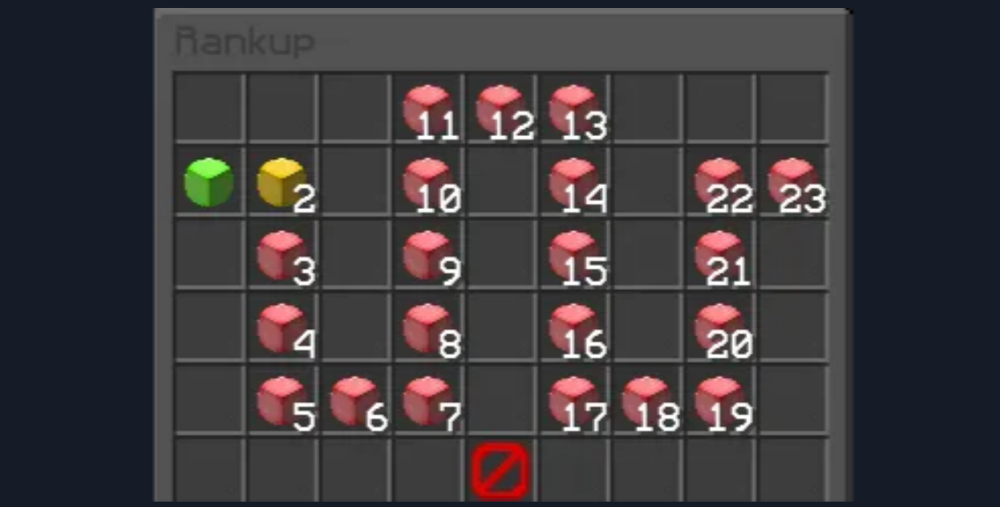

<!DOCTYPE html>
<html lang="es">
<head>
    <meta charset="UTF-8">
    <meta name="viewport" content="width=device-width, initial-scale=1.0">
    <title>0x99_ | Discord & Minecraft Developer</title>
    
</head>
<body>

<header>
    

        Developer & Configurador
        <h1>0x99_</h1>
        
Soluciones profesionales para Discord y Minecraft

    

</header>

    
    <section class="grid">
        

            <h2>🛠️ Habilidades</h2>
            <ul style="list-style: none; padding: 0;">
                <li style="margin-bottom: 10px;">↪ Configuración de <strong>servidores, Proxy , Bungee Etc.</strong>.</li>
                <li style="margin-bottom: 10px;">↪ Desarrollo de <strong>Bots</strong> en Py/JS.</li>
                <li style="margin-bottom: 10px;">↪ Gestión avanzada de <strong>YAML, JavaScript </strong>.</li>
                <li style="margin-bottom: 10px;">↪ Optimizacion de plugins , Configuraciones Unicas , Sistemas etc.</li>
            </ul>
            

                PythonJSYAML
            

        

        

            <h2>🚀 Bots Personalizados</h2>
            

                

                    
                    
                

                <button class="slider-btn prev" onclick="moveSlide('slider1', -1)">&#10094;</button>
                <button class="slider-btn next" onclick="moveSlide('slider1', 1)">&#10095;</button>
            

            
Bot oficial con gestión de tickets, base de datos y paneles personalizados.

        

        

            <h2>🎮 Minecraft GUI & Configs</h2>
            

                

                    
                    
                

                <button class="slider-btn prev" onclick="moveSlide('slider2', -1)">&#10094;</button>
                <button class="slider-btn next" onclick="moveSlide('slider2', 1)">&#10095;</button>
            

            
Diseño de menús interactivos, sistemas de Rankups y optimización de configuraciones.

        

    </section>

<section class="feedback-section">
        

            
            

                <h2>⭐ Reseñas de Clientes</h2>
                

                    

                        @OjoLatam Network
                        
"Excelente trabajo con la configuración del servidor, todo muy ordenado."

                    

                    

                        @CandyMC_Admin
                        
"El bot de tickets funciona a la perfección. 100% recomendado."

                    

                

            

            

                <h3>✍️ Deja tu Feedback</h3>
                <form action="https://formspree.io/f/xlgoerdy" method="POST" style="display: flex; flex-direction: column; gap: 10px;">
                    <label style="font-size: 0.8rem; color: var(--text-gray);">Tu Usuario de Discord o Nombre:</label>
                    <input type="text" name="name" placeholder="@TuUsuario" required 
                           style="padding: 10px; border-radius: 5px; border: none; background: #1e2124; color: white;">
                    
                    <label style="font-size: 0.8rem; color: var(--text-gray);">Tu Reseña:</label>
                    <textarea name="message" rows="4" placeholder="¿Qué te pareció el servicio?" required
                              style="padding: 10px; border-radius: 5px; border: none; background: #1e2124; color: white; resize: none;"></textarea>
                    
                    <button type="submit" class="btn" style="margin: 10px 0; background: var(--success); color: white; cursor: pointer; border: none;">
                        Enviar Reseña
                    </button>
                </form>
            

        

    </section>

    <section class="contact-box">
        <h2>¿Necesitas un developer?</h2>
        
<strong>Discord ID:</strong> 0x99_
    </section>

<footer style="text-align: center; padding: 40px; color: var(--text-gray); font-size: 0.8rem;">
    &copy; 2026 0x99_ | Portafolio Profesional
</footer>

    

</body>
</html>
